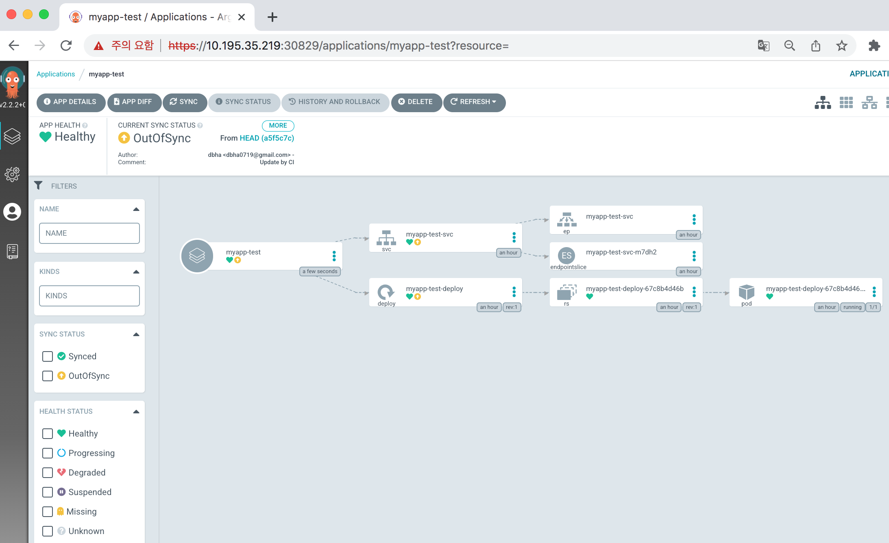

# TBS-Example

## Test Architecture     
  

## Installation
#### - https://docs.vmware.com/en/Tanzu-Build-Service/1.3/vmware-tanzu-build-service-v13/GUID-index.html

1) Prerequisites
 - Download three Carvel CLIs for your operating system (https://carvel.dev/)       
   * kapp, ytt, kbld, imgpkg

 - Download the kp CLI for your operating system from the Tanzu Build Service page on Tanzu Network (https://network.tanzu.vmware.com/products/build-service/)     
   * kp-linux or kp-darwin

 - Ready for Private registry     
   * Deployed for Shared Cluster via TKGm 1.4     
    ##
        ubuntu@ubuntu-202:~$ tanzu cluster list
        NAME                 NAMESPACE  STATUS   CONTROLPLANE  WORKERS  KUBERNETES        ROLES   PLAN
        tkg-shared-cluster   default    running  3/3           3/3      v1.21.2+vmware.1  <none>  dev

        # For Private Registry
        ubuntu@ubuntu-202:~$ k get po,httpproxy -n tanzu-system-registry
        NAME                                        READY   STATUS    RESTARTS   AGE
        pod/harbor-core-6c44fbc9c-kmd4w             1/1     Running   4          15d
        pod/harbor-database-0                       1/1     Running   36         15d
        pod/harbor-exporter-65b5dfb6fc-9snd7        1/1     Running   1          15d
        pod/harbor-jobservice-558ff4f9f4-fcf29      1/1     Running   2          15d
        pod/harbor-notary-server-745bfdd849-9l48g   1/1     Running   0          15d
        pod/harbor-notary-signer-7759c568fd-4xh2m   1/1     Running   1          15d
        pod/harbor-portal-7749c487b4-h9k9d          1/1     Running   0          15d
        pod/harbor-redis-0                          1/1     Running   0          15d
        pod/harbor-registry-58c67ffdff-z8vb4        2/2     Running   1          15d
        pod/harbor-trivy-0                          1/1     Running   0          15d

        NAME                                                  FQDN                            TLS SECRET   STATUS   STATUS DESCRIPTION
        httpproxy.projectcontour.io/harbor-httpproxy          harbor.lab.pksdemo.net          harbor-tls   valid    Valid HTTPProxy
        httpproxy.projectcontour.io/harbor-httpproxy-notary   notary.harbor.lab.pksdemo.net   harbor-tls   valid    Valid HTTPProxy

  - Ready for TBS Cluster
    * Deployed for test-cluster1 via TKGm 1.4
    ##
        ubuntu@ubuntu-202:~$ tanzu cluster list
        NAME                 NAMESPACE  STATUS   CONTROLPLANE  WORKERS  KUBERNETES        ROLES   PLAN
        test-cluster1        default    running  1/1           1/1      v1.21.2+vmware.1  <none>  dev     # for TBS
        tkg-shared-cluster   default    running  3/3           3/3      v1.21.2+vmware.1  <none>  dev     # for Private Registry

        ubuntu@ubuntu-202:~/TBS$ k get nodes -o wide
        NAME                                  STATUS   ROLES                  AGE   VERSION            INTERNAL-IP     EXTERNAL-IP     OS-IMAGE             KERNEL-VERSION     CONTAINER-RUNTIME
        test-cluster1-control-plane-dsp45     Ready    control-plane,master   17d   v1.21.2+vmware.1   10.195.35.204   10.195.35.204   Ubuntu 20.04.2 LTS   5.4.0-77-generic   containerd://1.4.6
        test-cluster1-md-0-869d857784-6vwhh   Ready    <none>                 16d   v1.21.2+vmware.1   10.195.35.212   10.195.35.212   Ubuntu 20.04.2 LTS   5.4.0-77-generic   containerd://1.4.6

2) Relocate Images to a Private Registry  
  - Log in to your image private registry
    ##
        ubuntu@ubuntu-202:~$ docker login harbor.lab.pksdemo.net
        Authenticating with existing credentials...
        Login did not succeed, error: Error response from daemon: login attempt to https://harbor.lab.pksdemo.net/v2/ failed with status: 401 Unauthorized
        Username (admin): admin
        Password:
        WARNING! Your password will be stored unencrypted in /home/ubuntu/.docker/config.json.
        Configure a credential helper to remove this warning. See
        https://docs.docker.com/engine/reference/commandline/login/#credentials-store

        Login Succeeded

  - Relocate the images with the Carvel tool imgpkg    
    ##
        imgpkg copy -b "registry.tanzu.vmware.com/build-service/bundle:1.3.0" --to-repo harbor.lab.pksdemo.net/tanzu/tbs --registry-ca-cert-path ./lab.pksdemo.net.crt
        copy | exporting 17 images...
        copy | will export registry.tanzu.vmware.com/build-service/bundle@sha256:0e64239d34119c1b8140d457a238050751360617d8e8b64703d8b7b4f944054a
        ......
        copy | will export registry.tanzu.vmware.com/build-service/sleeper@sha256:0c2d7d84a71b3c690883e6f7d04f6120496bd5f599fbca1a610472e159050409
        copy | will export registry.tanzu.vmware.com/build-service/smart-warmer@sha256:4d865b7f4c10c1099ae9648a64e6e7da097d0a375551e8fd2ef80a6d1fc50176

        copy | exported 17 images
        copy | importing 17 images...

        443.64 MiB / 443.64 MiB [=============================================================================================================================================================] 100.00% 16.33 MiB/s 27s

        copy | done uploading images
        copy | Warning: Skipped layer due to it being non-distributable. If you would like to include non-distributable layers, use the --include-non-distributable-layers flag

        Succeeded

  - Pull the Tanzu Build Service bundle locally using imgpkg
    ##
        mkdir -p ~/TBS
        ubuntu@ubuntu-202:~/TBS$ imgpkg pull -b "harbor.lab.pksdemo.net/tanzu/tbs:1.3.0" --registry-ca-cert-path ./lab.pksdemo.net.crt  -o /home/ubuntu/TBS/bundle
        Pulling bundle 'harbor.lab.pksdemo.net/tanzu/tbs@sha256:0e64239d34119c1b8140d457a238050751360617d8e8b64703d8b7b4f944054a'
        Extracting layer 'sha256:872d56ff2b8ef97689ecaa0901199d84e7f7ae55bfef3ad9c7effa14b02e6dfd' (1/1)

        Locating image lock file images...
        The bundle repo (harbor.lab.pksdemo.net/tanzu/tbs) is hosting every image specified in the bundle's Images Lock file (.imgpkg/images.yml)

        Succeeded

        ubuntu@ubuntu-202:~/TBS$ cd bundle/
        ubuntu@ubuntu-202:~/TBS/bundle$ ls
        config  values.yaml

  - Install Tanzu Build Service    
    ##
        ubuntu@ubuntu-202:~/TBS$ cat tbs-install-private-registry.sh
        ytt -f /home/ubuntu/TBS/bundle/values.yaml \
            -f /home/ubuntu/TBS/bundle/config/ \
            -f /home/ubuntu/TBS/lab.pksdemo.net.crt \
            -v kp_default_repository='harbor.lab.pksdemo.net/tanzu/tbs' \
            -v kp_default_repository_username='xxxxx' \
            -v kp_default_repository_password='xxxxx' \
            -v pull_from_kp_default_repo=true \
            -v tanzunet_username='xxxxx' \
            -v tanzunet_password='xxxxx' \
            | kbld -f /home/ubuntu/TBS/bundle/.imgpkg/images.yml -f- \
            | kapp deploy -a tanzu-build-service -f- -y

        ubuntu@ubuntu-202:~/TBS$ ./tbs-install-private-registry.sh
        resolve | final: build-init -> harbor.lab.pksdemo.net/tanzu/tbs@sha256:838e8f1ad7be81e8dab637259882f9c4daea70c42771264f96be4b57303d85f2
        resolve | final: completion -> harbor.lab.pksdemo.net/tanzu/tbs@sha256:765dafb0bb1503ef2f9d2deb33b476b14c85023e5952f1eeb46a983feca595c6
        resolve | final: dependency-updater -> harbor.lab.pksdemo.net/tanzu/tbs@sha256:f7f12379f7260eba45c006680d89255bda5b399e5271c885bfdd488751e59759
        resolve | final: dev.registry.tanzu.vmware.com/build-service/cert-injection-webhook@sha256:b868ab96d68046fe8cd6dc8a5b60908fbb933b5fb91a9acea9c3343afb4275e5 -> harbor.lab.pksdemo.net/tanzu/tbs@sha256:b868ab96d68046fe8cd6dc8a5b60908fbb933b5fb91a9acea9c3343afb4275e5
        resolve | final: dev.registry.tanzu.vmware.com/build-service/setup-ca-certs@sha256:9db5f18f469e8bdf0e3cac33035549d7f2993abaa28efbd56a5cf44ebb627f13 -> harbor.lab.pksdemo.net/tanzu/tbs@sha256:9db5f18f469e8bdf0e3cac33035549d7f2993abaa28efbd56a5cf44ebb627f13
        resolve | final: dev.registry.tanzu.vmware.com/build-service/stackify@sha256:f1f4c8af69422a3cc752dc821087cd36dbe6e8d282d85b5b42d2f704c39f3de3 -> harbor.lab.pksdemo.net/tanzu/tbs@sha256:f1f4c8af69422a3cc752dc821087cd36dbe6e8d282d85b5b42d2f704c39f3de3
        resolve | final: dev.registry.tanzu.vmware.com/build-service/stacks-operator@sha256:666d55e2d850d20617bf1db28b232c9c4fd683dd1e8e4eab5ba978ca76f94091 -> harbor.lab.pksdemo.net/tanzu/tbs@sha256:666d55e2d850d20617bf1db28b232c9c4fd683dd1e8e4eab5ba978ca76f94091
        resolve | final: gcr.io/cf-build-service-public/kpack/build-init-windows@sha256:85016da585421ec403f268f098dc0aac7efd60067f68c332c89d9a1047eb2826 -> harbor.lab.pksdemo.net/tanzu/tbs@sha256:85016da585421ec403f268f098dc0aac7efd60067f68c332c89d9a1047eb2826    
        .....     
        .....     
         Changes

        Namespace      Name                                                  Kind                            Conds.  Age  Op      Op st.  Wait to    Rs       Ri
        (cluster)      builds.kpack.io                                       CustomResourceDefinition        2/2 t   18h  update  -       reconcile  ok       -
        ^              customstacks.stacks.stacks-operator.tanzu.vmware.com  CustomResourceDefinition        0/0 t   18h  -       -       reconcile  ongoing  Condition Established is not set
        ^              defaults.webhook.cert-injection.tanzu.vmware.com      MutatingWebhookConfiguration    -       18h  update  -       reconcile  ok       -
        ^              defaults.webhook.kpack.io                             MutatingWebhookConfiguration    -       18h  update  -       reconcile  ok       -
        ^              images.kpack.io                                       CustomResourceDefinition        2/2 t   18h  update  -       reconcile  ok       -
        ^              validation.webhook.kpack.io                           ValidatingWebhookConfiguration  -       18h  update  -       reconcile  ok       -
        build-service  cert-injection-webhook-tls                            Secret                          -       18h  update  -       reconcile  ok       -
        kpack          lifecycle-image                                       ConfigMap                       -       18h  update  -       reconcile  ok       -
        ^              webhook-certs                                         Secret                          -       18h  update  -       reconcile  ok       -

        Op:      0 create, 0 delete, 8 update, 1 noop
        Wait to: 9 reconcile, 0 delete, 0 noop

        1:01:04AM: ---- applying 9 changes [0/9 done] ----
        1:01:04AM: noop customresourcedefinition/customstacks.stacks.stacks-operator.tanzu.vmware.com (apiextensions.k8s.io/v1) cluster
        1:01:04AM: update configmap/lifecycle-image (v1) namespace: kpack
        1:01:04AM: update customresourcedefinition/builds.kpack.io (apiextensions.k8s.io/v1) cluster
        1:01:04AM: update secret/webhook-certs (v1) namespace: kpack
        .....
        .....
        5:52:57PM: ---- waiting on 9 changes [0/9 done] ----
        5:52:57PM: ok: reconcile secret/webhook-certs (v1) namespace: kpack
        5:52:57PM: ok: reconcile configmap/lifecycle-image (v1) namespace: kpack
        5:52:57PM: ok: reconcile mutatingwebhookconfiguration/defaults.webhook.cert-injection.tanzu.vmware.com (admissionregistration.k8s.io/v1) cluster
        5:52:57PM: ok: reconcile customresourcedefinition/builds.kpack.io (apiextensions.k8s.io/v1) cluster
        5:52:57PM: ok: reconcile mutatingwebhookconfiguration/defaults.webhook.kpack.io (admissionregistration.k8s.io/v1) cluster
        5:52:57PM: ok: reconcile validatingwebhookconfiguration/validation.webhook.kpack.io (admissionregistration.k8s.io/v1) cluster
        5:52:57PM: ok: reconcile customresourcedefinition/images.kpack.io (apiextensions.k8s.io/v1) cluster
        5:52:57PM: ok: reconcile secret/cert-injection-webhook-tls (v1) namespace: build-service
        5:52:57PM: ok: reconcile customresourcedefinition/customstacks.stacks.stacks-operator.tanzu.vmware.com (apiextensions.k8s.io/v1) cluster
        5:52:57PM: ---- applying complete [9/9 done] ----
        5:52:57PM: ---- waiting complete [9/9 done] ----

        Succeeded

        ubuntu@ubuntu-202:~/TBS$ k get po -A
        NAMESPACE                NAME                                                        READY   STATUS      RESTARTS   AGE
        avi-system               ako-0                                                       1/1     Running     0          12h
        build-service            build-pod-image-fetcher-bfs64                               5/5     Running     0          13d
        build-service            cert-injection-webhook-79d44dc56d-8ffb4                     1/1     Running     0          12h
        build-service            dependency-updater-controller-767d475467-pmcz4              1/1     Running     0          13d
        build-service            secret-syncer-controller-745b69c48f-s994b                   1/1     Running     0          12h
        build-service            smart-warmer-image-fetcher-kxfkk                            6/6     Running     0          12h
        build-service            warmer-controller-5745765bd9-rlk8s                          1/1     Running     0          13d
        kpack                    kpack-controller-547f8d86b8-gk8nn                           1/1     Running     0          12h
        kpack                    kpack-webhook-5798cd84f9-cd9pf                              1/1     Running     0          12h
        kube-system              antrea-agent-9kf4j                                          2/2     Running     1          13d
        kube-system              antrea-agent-b52vc                                          2/2     Running     0          12d
        kube-system              antrea-controller-64fd7b89c8-tz8v5                          1/1     Running     0          12h
        kube-system              coredns-6bd5b686d4-twhzg                                    1/1     Running     0          12h
        kube-system              coredns-6bd5b686d4-vcqpm                                    1/1     Running     0          12h
        kube-system              etcd-test-cluster1-control-plane-dsp45                      1/1     Running     0          17d
        kube-system              kube-apiserver-test-cluster1-control-plane-dsp45            1/1     Running     0          15d
        kube-system              kube-controller-manager-test-cluster1-control-plane-dsp45   1/1     Running     9          15d
        kube-system              kube-proxy-7tns8                                            1/1     Running     0          15d
        kube-system              kube-proxy-lqr9k                                            1/1     Running     0          15d
        kube-system              kube-scheduler-test-cluster1-control-plane-dsp45            1/1     Running     6          15d
        kube-system              metrics-server-78648547bc-45qw2                             1/1     Running     0          12h
        kube-system              vsphere-cloud-controller-manager-mt6ls                      1/1     Running     25         15d
        kube-system              vsphere-csi-controller-c8d6486c6-f5r2t                      6/6     Running     54         15d
        kube-system              vsphere-csi-node-xcgg7                                      3/3     Running     0          13d
        kube-system              vsphere-csi-node-xp4x2                                      3/3     Running     0          17ds
        pinniped-concierge       pinniped-concierge-68ff5b94f-h9gpb                          1/1     Running     0          12h
        pinniped-concierge       pinniped-concierge-68ff5b94f-mvxtp                          1/1     Running     0          12h
        pinniped-concierge       pinniped-concierge-kube-cert-agent-455a3741                 1/1     Running     0          17d
        stacks-operator-system   controller-manager-676f887c57-2s8q5                         1/1     Running     0          12h
        tkg-system               kapp-controller-67fcf5dc4b-p5tf7                            1/1     Running     4          17d
        tkg-system               tanzu-capabilities-controller-manager-84464cccf4-ns8fm      1/1     Running     0          12h

3) Verify Installation
  - List the cluster builders or other resource available in test1-cluster
  ##
        ubuntu@ubuntu-202:~/TBS$ k get clusterbuilder,clusterstack,clusterstore
        NAME                                              LATESTIMAGE                                                                                                                                       READY
        clusterbuilder.kpack.io/base                      harbor.lab.pksdemo.net/tanzu/tbs:clusterbuilder-base@sha256:c51a6236bf3e4b2fda7f7460c2544c843f22695724dfdc404f11694642070d17                      True
        clusterbuilder.kpack.io/default                   harbor.lab.pksdemo.net/tanzu/tbs:clusterbuilder-default@sha256:c51a6236bf3e4b2fda7f7460c2544c843f22695724dfdc404f11694642070d17                   True
        clusterbuilder.kpack.io/full                      harbor.lab.pksdemo.net/tanzu/tbs:clusterbuilder-full@sha256:a787b83cd3deb209096613a4ddc0d759b62d70598fe870d11c40f110762a493a                      True
        clusterbuilder.kpack.io/my-java-clusterbuilder    harbor.lab.pksdemo.net/tanzu/tbs:clusterbuilder-my-java-clusterbuilder@sha256:01e24b7ddac0ff15a02b026393e4c6d7866c2872ad0de7c0c00f34d4f3568fee    True
        clusterbuilder.kpack.io/my-java-clusterbuilder1   harbor.lab.pksdemo.net/tanzu/tbs:clusterbuilder-my-java-clusterbuilder1@sha256:2dee253d64d78ec51e7263fb1e6a89aa4a831758518aee759fd638f6298235ae   True
        clusterbuilder.kpack.io/tiny                      harbor.lab.pksdemo.net/tanzu/tbs:clusterbuilder-tiny@sha256:7d22033fae13ae40ef2dbdd17452d24ae74b882738e382be74813bd9ea4484e3                      True

        NAME                            READY
        clusterstack.kpack.io/base      True
        clusterstack.kpack.io/default   True
        clusterstack.kpack.io/full      True
        clusterstack.kpack.io/tiny      True

        NAME                            READY
        clusterstore.kpack.io/default   True

## Create Test an Image

1) Create a Secret     

    ubuntu@ubuntu-202:~/TBS/tbs-test$ k create ns myapp-test     
    namespace/myapp-test created     

    ubuntu@ubuntu-202:~/TBS/tbs-test$ REGISTRY_PASSWORD="xxxxx" kp secret create my-registry-creds --registry harbor.lab.pksdemo.net --registry-user admin -n myapp-test     
    Secret "my-registry-creds" created

2) Create Tanzu Build Service Image  
    ##
        # sample
        kp image create my-image --tag my.registry.io/tbs/test-app --git https://github.com/buildpacks/samples --sub-path ./apps/java-maven --wait

    ##
        # Create test-create-image.sh
        export APP_NAME=myapp-test     
        export NAMESPACE=myapp-test     
        export GIT_URL=https://github.com/dbha/myapp-test     
        export CLUSTER_BUILDER=default       
        export TAG=harbor.lab.pksdemo.net/tanzu/app/myapp-test    
        export GIT_REVISION=master

        kp image create -n "${NAMESPACE}" "${APP_NAME}" --git "${GIT_URL}" --cluster-builder "${CLUSTER_BUILDER}" --tag $TAG --git-revision "${GIT_REVISION}" --env BP_GRADLE_BUILD_ARGUMENTS='--no-daemon build' -w

    ##
        # script execution
        ubuntu@ubuntu-202:~/TBS/tbs-test$ ./test-create-image.sh
        Error: secrets "my-registry-creds" already exists
        Creating Image Resource...
        Image Resource "myapp-test" created
        ===> SETUP-CA-CERTS
        Create certificate...
        Populate certificate...
        Update CA certificates...
        Copying CA certificates...
        Finished setting up CA certificates
        ===> PREPARE
        Build reason(s): CONFIG
        CONFIG:
            + env:
            + - name: BP_GRADLE_BUILD_ARGUMENTS
            +   value: --no-daemon build
            resources: {}
            - source: {}
            + source:
            +   git:
            +     revision: db9ed907f456073826487cadbd32724024d7e3b6
            +     url: https://github.com/dbha/myapp-test
        Loading secret for "harbor.lab.pksdemo.net" from secret "my-registry-creds" at location "/var/build-secrets/my-registry-creds"
        Cloning "https://github.com/dbha/myapp-test" @ "db9ed907f456073826487cadbd32724024d7e3b6"...
        Successfully cloned "https://github.com/dbha/myapp-test" @ "db9ed907f456073826487cadbd32724024d7e3b6" in path "/workspace"
        ===> DETECT
        7 of 34 buildpacks participating
        paketo-buildpacks/ca-certificates   2.4.2
        paketo-buildpacks/bellsoft-liberica 8.9.0
        paketo-buildpacks/maven             5.7.0
        paketo-buildpacks/executable-jar    5.3.1
        .....    
        .....     

        ===> ANALYZE
        Warning: Not restoring cached layer metadata, no cache flag specified.
        Restoring metadata for "paketo-buildpacks/ca-certificates:helper" from app image
        Restoring metadata for "paketo-buildpacks/bellsoft-liberica:helper" from app image
        Restoring metadata for "paketo-buildpacks/bellsoft-liberica:java-security-properties" from app image
        .....     

        ===> RESTORE
        Warning: Not restoring cached layer data, no cache flag specified.     
        
        ===> BUILD

        Paketo CA Certificates Buildpack 2.4.2
        https://github.com/paketo-buildpacks/ca-certificates
        Launch Helper: Reusing cached layer

        Paketo BellSoft Liberica Buildpack 8.9.0      
        ......  
        INFO] Downloaded from central: https://repo.maven.apache.org/maven2/org/vafer/jdependency/2.3.0/jdependency-2.3.0.jar (169 kB at 475 kB/s)
        [INFO] Downloaded from central: https://repo.maven.apache.org/maven2/org/ow2/asm/asm-util/7.2-beta/asm-util-7.2-beta.jar (81 kB at 223 kB/s)
        [INFO] Downloaded from central: https://repo.maven.apache.org/maven2/com/google/guava/guava/19.0/guava-19.0.jar (2.3 MB at 4.9 MB/s)
        [INFO] Replacing main artifact with repackaged archive
        [INFO] ------------------------------------------------------------------------
        [INFO] BUILD SUCCESS
        [INFO] ------------------------------------------------------------------------
        [INFO] Total time:  04:37 min
        [INFO] Finished at: 2022-01-24T03:07:24Z
        [INFO] ------------------------------------------------------------------------

        ===> EXPORT
        Warning: Will not cache data, no cache flag specified.
        Reusing layers from image 'harbor.lab.pksdemo.net/tanzu/app/myapp-test@sha256:653237f151b987ad8a8184a1ac3b496ec65c51da1e28df26c5594613dc7a8bf7'
        Reusing layer 'paketo-buildpacks/ca-certificates:helper'
        .....     
        Setting default process type 'web'
        Saving harbor.lab.pksdemo.net/tanzu/app/myapp-test...
        *** Images (sha256:653237f151b987ad8a8184a1ac3b496ec65c51da1e28df26c5594613dc7a8bf7):
            harbor.lab.pksdemo.net/tanzu/app/myapp-test
            harbor.lab.pksdemo.net/tanzu/app/myapp-test:b1.20220124.030213
        ===> COMPLETION
        Build successful

        # check image
        ubuntu@ubuntu-202:~/TBS/tbs-test$ k get build,image -n myapp-test
        NAME                                IMAGE                                                                                                                 SUCCEEDED
        build.kpack.io/myapp-test-build-1   harbor.lab.pksdemo.net/tanzu/app/myapp-test@sha256:653237f151b987ad8a8184a1ac3b496ec65c51da1e28df26c5594613dc7a8bf7   True

        NAME                        LATESTIMAGE                                                                                                           READY
        image.kpack.io/myapp-test   harbor.lab.pksdemo.net/tanzu/app/myapp-test@sha256:653237f151b987ad8a8184a1ac3b496ec65c51da1e28df26c5594613dc7a8bf7   True

## Deploy argocd & Jenkins for GITOPS Environment     
1) Install argocd on Shard Cluster
##
    # Leverage tkg-shared-cluster for private registry(Harbor) and argocd and jenkins. However, App will be deployed on test-cluster1.
    ubuntu@ubuntu-202:~/TBS/tbs-test$ k config use-context tkg-shared-cluster-admin@tkg-shared-cluster  # Deploy for argo & jenkins
    Switched to context "tkg-shared-cluster-admin@tkg-shared-cluster".

##
    # Download argocd CLI
    VERSION=$(curl --silent "https://api.github.com/repos/argoproj/argo-cd/releases/latest" | grep '"tag_name"' | sed -E 's/.*"([^"]+)".*/\1/')
    curl -sSL -o /usr/local/bin/argocd https://github.com/argoproj/argo-cd/releases/download/$VERSION/argocd-linux-amd64 or
    curl -sSL -o /usr/local/bin/argocd https://github.com/argoproj/argo-cd/releases/download/$VERSION/argocd-darwin-amd64

    ubuntu@ubuntu-202:~/TBS$ VERSION=$(curl --silent "https://api.github.com/repos/argoproj/argo-cd/releases/latest" | grep '"tag_name"' | sed -E 's/.*"([^"]+)".*/\1/')
    ubuntu@ubuntu-202:~/TBS$ echo $VERSION
    v2.2.3

    ubuntu@ubuntu-202:~/TBS$ argocd version
    argocd: v2.2.3+987f665
    BuildDate: 2022-01-18T17:53:49Z
    GitCommit: 987f6659b88e656a8f6f8feef87f4dd467d53c44
    GitTreeState: clean
    GoVersion: go1.16.11
    Compiler: gc
    Platform: linux/amd64
    FATA[0000] Argo CD server address unspecified

 ##
    # Download install file
    curl https://raw.githubusercontent.com/argoproj/argo-cd/stable/manifests/install.yaml -o argo-cd.yaml

    # Change argo-cd.yaml & deploy argocd
    ....
    apiVersion: v1
    kind: Service
    metadata:
    labels:
        app.kubernetes.io/component: server
        app.kubernetes.io/name: argocd-server
        app.kubernetes.io/part-of: argocd
    name: argocd-server
    spec:
    type: NodePort   # Add NodePort type for web-UI
    ports:
    - name: http
        port: 80
        protocol: TCP
        targetPort: 8080
    - name: https
        port: 443
        protocol: TCP
        targetPort: 8080
    selector:
        app.kubernetes.io/name: argocd-server
    ....

    ubuntu@ubuntu-202:~/TBS/tbs-test$ k create ns argocd
    namespace/argocd created
  
    ubuntu@ubuntu-202:~/TBS/tbs-test$ k apply -f argo-cd.yaml -n argocd
    customresourcedefinition.apiextensions.k8s.io/applications.argoproj.io created
    customresourcedefinition.apiextensions.k8s.io/appprojects.argoproj.io created
    serviceaccount/argocd-application-controller created
    serviceaccount/argocd-dex-server created
    serviceaccount/argocd-redis created
    .....     
    networkpolicy.networking.k8s.io/argocd-redis-network-policy created
    networkpolicy.networking.k8s.io/argocd-repo-server-network-policy created
    networkpolicy.networking.k8s.io/argocd-server-network-policy create

    # Check argocd
    ubuntu@ubuntu-202:~/TBS/tbs-test$ k get po,svc -n argocd
    NAME                                      READY   STATUS    RESTARTS   AGE
    pod/argocd-application-controller-0       1/1     Running   0          4m1s
    pod/argocd-dex-server-66f865ffb4-r58rj    1/1     Running   1          4m5s
    pod/argocd-redis-5b6967fdfc-rq7qn         1/1     Running   0          4m5s
    pod/argocd-repo-server-656c76778f-6vmqc   1/1     Running   0          4m4s
    pod/argocd-server-cd68f46f8-497zq         1/1     Running   0          4m3s

    NAME                            TYPE        CLUSTER-IP       EXTERNAL-IP   PORT(S)                      AGE
    service/argocd-dex-server       ClusterIP   100.71.222.42    <none>        5556/TCP,5557/TCP,5558/TCP   4m11s
    service/argocd-metrics          ClusterIP   100.69.96.56     <none>        8082/TCP                     4m10s
    service/argocd-redis            ClusterIP   100.66.62.133    <none>        6379/TCP                     4m9s
    service/argocd-repo-server      ClusterIP   100.66.217.182   <none>        8081/TCP,8084/TCP            4m8s
    service/argocd-server           NodePort    100.71.74.127    <none>        80:30080/TCP,443:30829/TCP   4m7s
    service/argocd-server-metrics   ClusterIP   100.71.178.70    <none>        8083/TCP                     4m6s

    # Change password argocd's user(admin)
    ubuntu@ubuntu-202:~/TBS/tbs-test$ k get secret argocd-initial-admin-secret -n argocd -o jsonpath='{.data.password}' | base64 --decode
    xxxxx
    ubuntu@ubuntu-202:~/TBS/tbs-test$
    ubuntu@ubuntu-202:~/TBS/tbs-test$ argocd login 10.195.35.219:30080
    WARNING: server certificate had error: x509: cannot validate certificate for 10.195.35.219 because it doesn't contain any IP SANs. Proceed insecurely (y/n)? y
    Username: admin
    Password:
    'admin:login' logged in successfully
    Context '10.195.35.219:30080' updated

    ubuntu@ubuntu-202:~/TBS/tbs-test$ argocd account update-password
    *** Enter password of currently logged in user (admin):
    *** Enter new password for user admin:
    *** Confirm new password for user admin:
    Password updated
    Context '10.195.35.219:30080' updated

2) Install Jenkins by helm

##
    # Pull stabel chart
    helm pull stable/jenkins

    # Change values.yaml
    cd jenkins
    cp values.yaml values.yaml.org

    vi values.yaml
    ...
    adminUser: "admin"
    adminPassword: "xxxxx"   # Password change
    admin:
        existingSecret: ""
        userKey: jenkins-admin-user
        passwordKey: jenkins-admin-password
    ...
    installPlugins:      # (If required) pre-defined plugin
    #    - kubernetes:1.25.7
    #    - workflow-job:2.39
    #    - workflow-aggregator:2.6
    #    - credentials-binding:1.23
    #    - git:4.2.2
    #    - configuration-as-code:1.41
    ...
    persistence:
    enabled: true
    ## A manually managed Persistent Volume and Claim
    ## Requires persistence.enabled: true
    ## If defined, PVC must be created manually before volume will be bound
    existingClaim:
    ## jenkins data Persistent Volume Storage Class
    ## If defined, storageClassName: <storageClass>
    ## If set to "-", storageClassName: "", which disables dynamic provisioning
    ## If undefined (the default) or set to null, no storageClassName spec is
    ##   set, choosing the default provisioner.  (gp2 on AWS, standard on
    ##   GKE, AWS & OpenStack)
    ##
    storageClass:
    annotations: {}
    accessMode: "ReadWriteOnce"
    size: "8Gi"    # Change size (default 8G)

    # Install chart
    helm install jenkins -f jenkins/values.yaml ./jenkins -n jenkins 

    # Check jenkins
    ubuntu@ubuntu-202:~/TBS/tbs-test$ k get po,svc -n jenkins
    NAME                           READY   STATUS    RESTARTS   AGE
    pod/jenkins-685767d9fc-6llb7   2/2     Running   8          10d

    NAME                           TYPE        CLUSTER-IP       EXTERNAL-IP   PORT(S)          AGE
    service/jenkins                ClusterIP   100.65.239.51    <none>        8080/TCP         10d
    service/jenkins-agent          ClusterIP   100.64.195.18    <none>        50000/TCP        10d
    service/jenkins-nodeport-svc   NodePort    100.64.120.239   <none>        8080:31808/TCP   10d

    
    # Get test-cluster1 kubeconfig
    tanzu cluster kubeconfig get test-cluster1 --admin --export-file=./test-cluster1-kubeconfig-sa

    # Create kubeconfig to connect test-cluster1 using secret on shared-cluster which was deployed Jenkins.
    k create secret generic test-cluster1-kubeconfig-secret -n jenkins --from-file=./test-cluster1-kubeconfig-sa -o yaml --dry-run=client  > create-secret-test-cluster1-kubeconfig.yaml
    
    # In jenkins NS, create secret to connect test-cluster1
    k apply -f create-secret-test-cluster1-kubeconfig.yaml
    ubuntu@ubuntu-202:~/TBS$ k get secret -n jenkins | grep test-cluster1
    test-cluster1-kubeconfig-secret   Opaque                                1      12d

3) Main configure Jenkins & git 
##
    # In Jenkins
    - Manage Plugin (In my case)
    kubernetes:1.29.2
    job-dsl:1.77
    envinject:2.4.0
    ssh-agent:1.22
    kubernetes-credentials-provider:0.18-1
    Git github
    pipeline
    Config File Provider(managed file)

    - Configure Cloud
    Set Jenkins URL >> http://jenkins:8000
    Set Jenkins tunnel >> jenkins-agent:50000

    - Credentials
    create git-user
    create jenkins-ssh-private-key
    .....

    # git
    - add jenkins-ssh-public-key
    - create credentials for git token
    .....

## Create Jenkins Pipeline & Build & deploy without argocd

1) Configure via Jenkins UI    
    
    
    

2) Start Build
##
    # Change context test1-cluster & As soon as the build starts in UI
    

     k get po,build,image -n myapp-test
    NAME                               READY   STATUS     RESTARTS   AGE
    pod/myapp-test-build-1-build-pod   0/1     Init:5/7   0          107s

    # after builld, deploy mytest-app on test1-cluster
     k get po,svc,build,image -n myapp-test
    NAME                                     READY   STATUS      RESTARTS   AGE
    pod/myapp-test-build-1-build-pod         0/1     Completed   0          34m
    pod/myapp-test-deploy-67c8b4d46b-gdp56   1/1     Running     0          27m

    NAME                     TYPE       CLUSTER-IP       EXTERNAL-IP   PORT(S)          AGE
    service/myapp-test-svc   NodePort   100.67.101.147   <none>        8080:31770/TCP   27m

    NAME                                IMAGE                                                                                                                  SUCCEEDED
    build.kpack.io/myapp-test-build-1   harbor.lab.pksdemo.net/tanzu/apps/myapp-test@sha256:4321639b37cdf96ac305f7c627db83464b1c5dc167ea12af38d3a514ae2b69a2   True

    NAME                        LATESTIMAGE                                                                                                            READY
    image.kpack.io/myapp-test   harbor.lab.pksdemo.net/tanzu/apps/myapp-test@sha256:4321639b37cdf96ac305f7c627db83464b1c5dc167ea12af38d3a514ae2b69a2   True

    # Test
     curl http://10.195.35.212:31770/hello
    Spring Boot dha TEST11%
     

## Create Jenkins Pipeline & Build & deploy with argocd     

1) Register test-cluster1 to deploy app via argocd cli
##
    # Download test-cluster1 kubeconfig
    ubuntu@ubuntu-202:~/TBS$ tanzu cluster kubeconfig get test-cluster1 --admin --export-file test-cluster1-kubeconfig
    Credentials of cluster 'test-cluster1' have been saved
    You can now access the cluster by running 'kubectl config use-context test-cluster1-admin@test-cluster1' under path 'test-cluster1-kubeconfig'
    ubuntu@ubuntu-202:~/TBS$ ls -lrt test-cluster1-kubeconfig
    -rw------- 1 ubuntu ubuntu 5598 Jan 23 23:16 test-cluster1-kubeconfig

    # Add cluster via argocd CLI     
    # NOTE) before below command, you should have to use context shared cluster which was deployed argocd

    ubuntu@ubuntu-202:~/TBS$ k config get-contexts
    CURRENT   NAME                                            CLUSTER               AUTHINFO                    NAMESPACE
              test-cluster1-admin@test-cluster1               test-cluster1         test-cluster1-admin
              tkg-mgmt-cluster-admin@tkg-mgmt-cluster         tkg-mgmt-cluster      tkg-mgmt-cluster-admin
    *         tkg-shared-cluster-admin@tkg-shared-cluster     tkg-shared-cluster    tkg-shared-cluster-admin

    # argocd cluster add test-cluster1-admin@test-cluster1 --kubeconfig /home/ubuntu/TBS/test-cluster1-kubeconfig
    ubuntu@ubuntu-202:~/TBS$ argocd cluster add test-cluster1-admin@test-cluster1 --kubeconfig /home/ubuntu/TBS/test-cluster1-kubeconfig
    WARNING: This will create a service account `argocd-manager` on the cluster referenced by context `test-cluster1-admin@test-cluster1` with full cluster level admin privileges. Do you want to continue [y/N]? y
    INFO[0003] ServiceAccount "argocd-manager" already exists in namespace "kube-system"
    INFO[0003] ClusterRole "argocd-manager-role" updated
    INFO[0003] ClusterRoleBinding "argocd-manager-role-binding" updated
    Cluster 'https://10.193.245.179:6443' added

    # argocd cluster list
    ubuntu@ubuntu-202:~/TBS$ argocd cluster list
    SERVER                          NAME                               VERSION  STATUS   MESSAGE                                              PROJECT
    https://10.193.245.179:6443     test-cluster1-admin@test-cluster1           Unknown  Cluster has no application and not being monitored.
    https://kubernetes.default.svc  in-cluster                                  Unknown  Cluster has no application and not being monitored.

2) App Register vi argocd UI     
##
    # Push deployment manifest file for gitops
    In my case, I used my myapp-test-gitops repo. (https://github.com/dbha/myapp-test-gitops)

    # App Creation via argocd UI     

3) Change JenkinsFille & git push & Build via Jenkins UI
##    
    # Input JenkinsFile without "kubectl apply -k ..."

    # Change Code in myapp-test App (just change return text)
    

4) after Jekins build, Sync via argocd
    # Sync App in argo UI

    # Deploy myapp-test to new version
  

    # Test New version
     curl http://10.195.35.212:31770/hello
    Spring Boot Test gitops%

     k get po,image,build -n myapp-test
    NAME                                     READY   STATUS      RESTARTS   AGE
    pod/myapp-test-build-1-build-pod         0/1     Completed   0          18h
    pod/myapp-test-build-2-build-pod         0/1     Completed   0          16h
    pod/myapp-test-build-3-build-pod         0/1     Completed   0          11h
    pod/myapp-test-deploy-5b8b58fb6d-jwjb5   1/1     Running     0          16h

    NAME                        LATESTIMAGE                                                                                                            READY
    image.kpack.io/myapp-test   harbor.lab.pksdemo.net/tanzu/apps/myapp-test@sha256:8dce22c72bec3c24aa04ad8d1821bcc173bba6523cd1d54695cd61b95739864c   True

    NAME                                IMAGE                                                                                                                  SUCCEEDED
    build.kpack.io/myapp-test-build-1   harbor.lab.pksdemo.net/tanzu/apps/myapp-test@sha256:4321639b37cdf96ac305f7c627db83464b1c5dc167ea12af38d3a514ae2b69a2   True
    build.kpack.io/myapp-test-build-2   harbor.lab.pksdemo.net/tanzu/apps/myapp-test@sha256:267a923d605f42df0cae8096ff65376903e8afc32b9ffbcc2ab9c90f88f4ea3a   True
    build.kpack.io/myapp-test-build-3   harbor.lab.pksdemo.net/tanzu/apps/myapp-test@sha256:8dce22c72bec3c24aa04ad8d1821bcc173bba6523cd1d54695cd61b95739864c   True